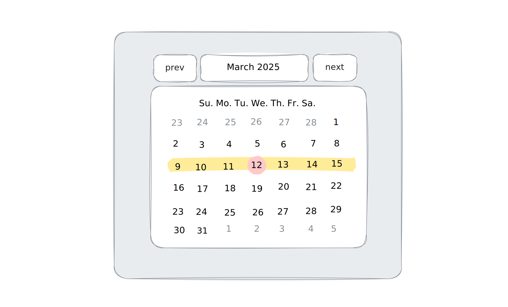

# LIA

> Weight: 30%\
> Due: April 8

Your task for the LIA is to to build a web page that displays a monthly
calendar, as shown above. Here are the requirements:

- You must use the [Date API] to dynamically display the current month
  of the current year.
- The current week and the current day must also be dynamically
  highlighted.
- The page must include buttons to show the previous and next months.

> [!IMPORTANT]
> Different months start on different days of the week. Use the `getDay`
> method to know the day of the week for a given `Date` object.

[Date API]: https://developer.mozilla.org/en-US/docs/Web/JavaScript/Reference/Global_Objects/Date

## Starter files and submission

To access the starter files, first [accept the assignment][Classroom],
then download the repository (Code → Download ZIP). To submit your
assignment, upload only the `index.ts` on GitHub. Do not rename it, zip
it, or place it inside a folder.

[Classroom]: https://classroom.github.com/a/5mdNGyNn

## Assessment criteria

- Program design [5]
  - requirements are met
  - tests pass
  - program flow is decomposed into manageable, logical pieces
  - data structures are appropriate
  - common code is unified, not duplicated
  - appropriate algorithms are used, and coded cleanly
  - no global variables
  - code is lint-free (run `bun lint`)

- Readability [5]
  - constants are used instead of hard-coded values
  - complex or meaningful expressions are named
  - naming is consistent and descriptive
  - inline comments are used only to explain reasoning
  - type annotations are correct (run `bun typecheck`)
  - code is formatted (run `bun fmt`)
